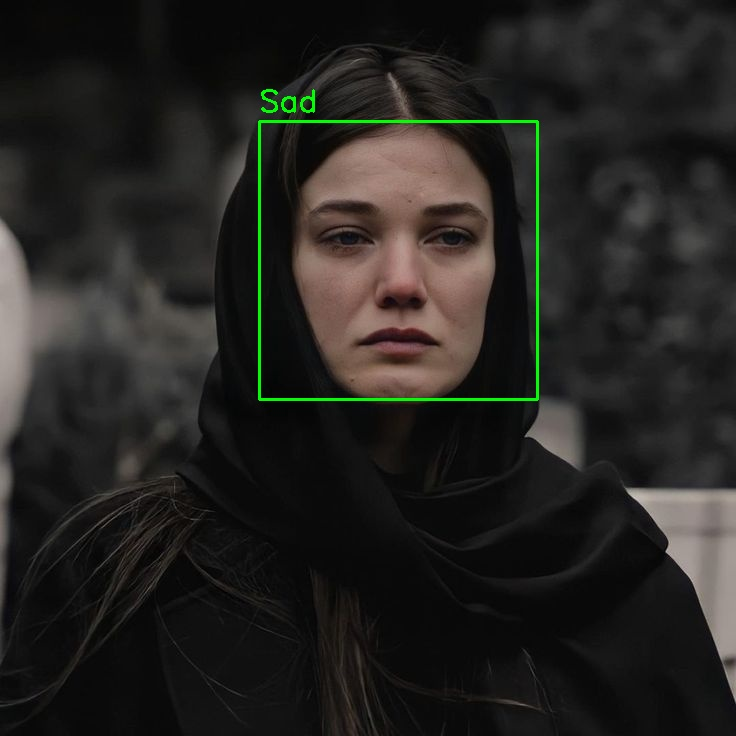

# EmotionDetect

EmotionDetect is a deep learning project that detects emotions in images using a pre-trained model.

## Features
- Detects seven emotions: Angry, Disgust, Fear, Happy, Sad, Surprise, and Neutral.
- Draws bounding boxes and labels on faces in the images.

## Requirements
- Python 3.7+
- TensorFlow 2.x
- Keras
- OpenCV
- h5py
- numpy

## Installation

1. Clone the repository:
    ```sh
    git clone https://github.com/alimalekshahian/EmotionDetect.git
    cd EmotionDetect
    ```

2. Install the required packages:
    ```sh
    pip install -r requirements.txt
    ```

3. Place your model file `fer2013_mini_XCEPTION.102-0.66.hdf5` in the `models/` directory.

## Usage

1. Add your input images to the `images/` directory.

2. Run the emotion detection:
    ```sh
    python src/emotion_detection.py
    ```

3. The output image with emotion labels will be saved in the `images/` directory.

## Example

Input:


Output:


## License

This project is licensed under the MIT License - see the [LICENSE](LICENSE) file for details.

## Contributing

1. Fork it (https://github.com/alimalekshahian/EmotionDetect/fork)
2. Create your feature branch (`git checkout -b feature/fooBar`)
3. Commit your changes (`git commit -am 'Add some fooBar'`)
4. Push to the branch (`git push origin feature/fooBar`)
5. Create a new Pull Request

